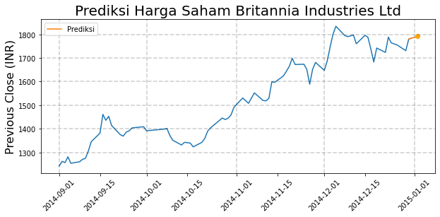

# Prediksi Harga Saham Britannia Industries Ltd
_Britannia Stock Price Prediction_ pada market NIFTY 50

## Abstrak
Model terbaik (ARIMA(1, 2, 1)) memprediksi harga saham (khususnya _previous close_) Britannia Industries Ltd pada permulaan Januari 2015 mengalami kenaikan.

## Tools dan Sumber Data
**Python 3.9** \
**Packages:** numpy, pandas, matplotlib, statsmodels, scikit-learn, tqdm, datetime \
**Data:** https://www.kaggle.com/rohanrao/nifty50-stock-market-data

## Hasil
### Pemodelan
| Keterangan | Model | RMSE | MAPE |
| --- | --- | --- | --- |
| _Baseline_ | ARIMA(1, 1, 1) | 111.6 | 5.88% |
| _Manual tuning_ orde d | ARIMA(1, 2, 1) | 69.1 | 2.95% |
| _Auto-tuning_ p, d, q | ARIMA(0, 1, 1) | 83.2 | 3.94% |
| Memperhitungkan seasonality (_auto-tuning_) | SARIMA(2, 1, 0)(2, 1, 0)[28] | 72.14 | 3.41% |
| _Rolling forecast_ ARIMA | ARIMA(1, 2, 1) | 30.1 | 1.38% |

### Prediksi

## Kesimpulan
+ Model terbaik yang dapat digunakan untuk memprediksi adalah ARIMA(1, 2, 1) dengan error 2.95%
+ Harga saham Britannia Industries Ltd pada awal Januari 2015 diprediksi naik menuju nilai sekitar 1790 INR
